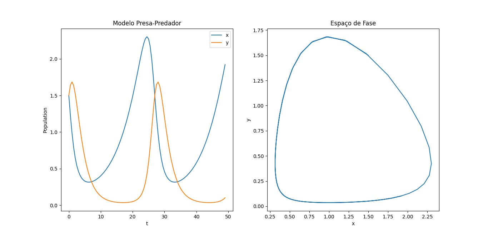

# Sistema Acoplado de EDOs com Runge-Kutta de 4° Ordem
Resolução de Sistema Acoplado de Equações Diferenciais Ordinárias Lotka-Volterra com Método Runge-Kutta de 4° Ordem.

Para $\alpha=0.3, \beta=0.7, \gamma=\delta=1$ e $t_{max}=50$ Obtemos o seguinte:

$$ϕ(t,x,y)=x(0.3-0.7y)$$

$$ψ(t,x,y)=y(x - 1)$$

Assim, com a descrição das funções $\psi$ e $\phi$, conseguiremos calcular o sistema acoplado de equações diferenciais ordinárias (EDOs) pelo método Runge-Kutta de 4° Ordem.

$$k_{1x}=h\phi\left(t_n,x_n,y_n\right)$$

$$k_{1y}=h\psi\left(t_n,x_n,y_n\right)$$

$$k_{2x}=h\phi\left(t_n\ +\ \frac{h}{2},x_n+\frac{h}{2}K_{1x},y_n+\frac{h}{2}K_{1y}\right)$$

$$k_{2y}=h\psi\left(t_n\ +\ \frac{h}{2},x_n+\frac{h}{2}K_{1x},y_n+\frac{h}{2}K_{1y}\right)$$

$$k_{3x}=h\phi\left(t_n\ +\ \frac{h}{2},x_n+\frac{h}{2}K_{2x},y_n+\frac{h}{2}K_{2y}\right)$$

$$k_{3y}=h\psi\left(t_n\ +\ \frac{h}{2},x_n+\frac{h}{2}K_{2x},y_n+\frac{h}{2}K_{2y}\right)$$

$$k_{4x}=h\phi\left(t_n+h,x_n+hk_{3x},y_n+hk_{3y}\right)$$

$$k_{4y}=h\psi\left(t_n+h,x_n+hk_{3x},y_n+hk_{3y}\right)$$

Para encontrarmos:

$$x_{n+1}=x_n+\frac{h}{6}\left(k_{1x}+2k_{2x}+2k_{3x}+k_{4x}\right)$$

$$y_{n+1}=y_n+\frac{h}{6}\left(k_{1y}+2k_{2y}+2k_{3y}+k_{4y}\right)$$

Com $h = 0.5, t_0=0, n \in [0, 100]$ e $(x_0, y_0)=(1.5, 1.5)$, obteremos os seguintes gráficos:

